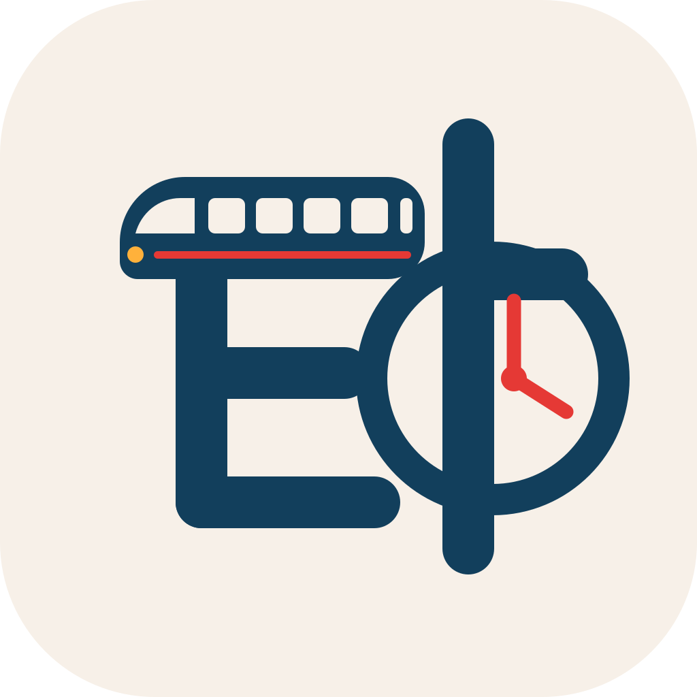

# 타야돼 앱 아이콘 후보 A/B/C

`타` 한 글자의 획에 지하철과 시계를 결합한 앱 아이콘 후보입니다. 모두 1024×1024 편집 가능한 SVG입니다.

| A — Train Silhouette | B — Subway Map | C — Bold Ta Clock |
| --- | --- | --- |
|  |  |  |
| 지하철과 시계가 가장 즉각적으로 보이는 안 | 가장 단순하고 작은 크기에서 강한 안 | 굵어진 획과 분명한 `ㅏ`로 글자 인식을 강화한 안 |

## 선택 가이드

- A: 서비스가 지하철 앱이라는 점을 첫눈에 전달하는 것이 우선일 때
- B: 홈 화면의 작은 아이콘과 향후 브랜드 확장성이 우선일 때
- C: 첫인상에서 `타`가 정확하게 읽히는 것과 앱 아이콘의 힘 있는 인상이 우선일 때

## 공통 규격

- 캔버스: 1024×1024
- 배경: `#F7F0E8`
- 주 획: `#123F5C`
- 크림슨 포인트: `#E53935`
- 앰버 포인트: `#FFB13B`
- 모서리 반경: 228px
- 래스터 이미지, 앱 이름, 노선 번호, 3D 효과 없음

## 원본

- [Figma 편집 파일](https://www.figma.com/design/2h9TRoNUf195jYjH706fIa)
- [A SVG](./icon-a-train-silhouette.svg)
- [B SVG](./icon-b-subway-map.svg)
- [C SVG](./icon-c-bold-ta-clock.svg)
